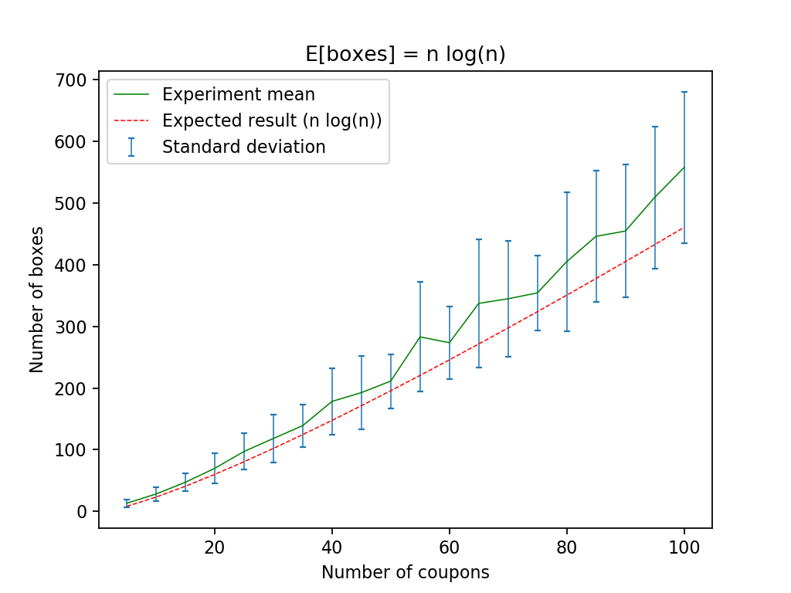
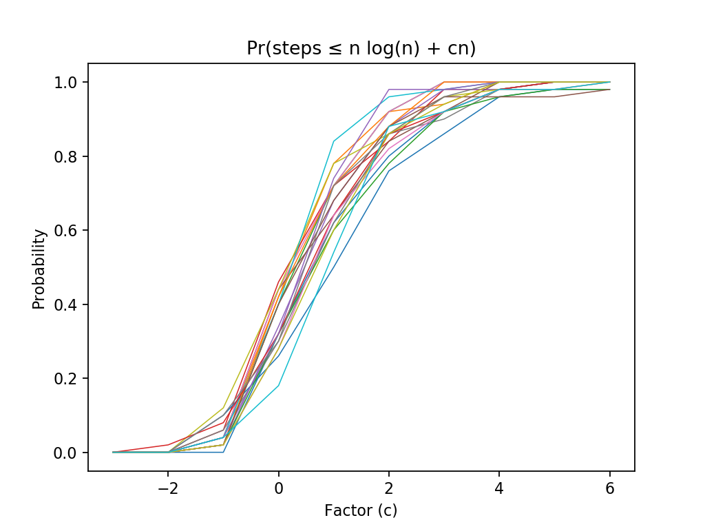
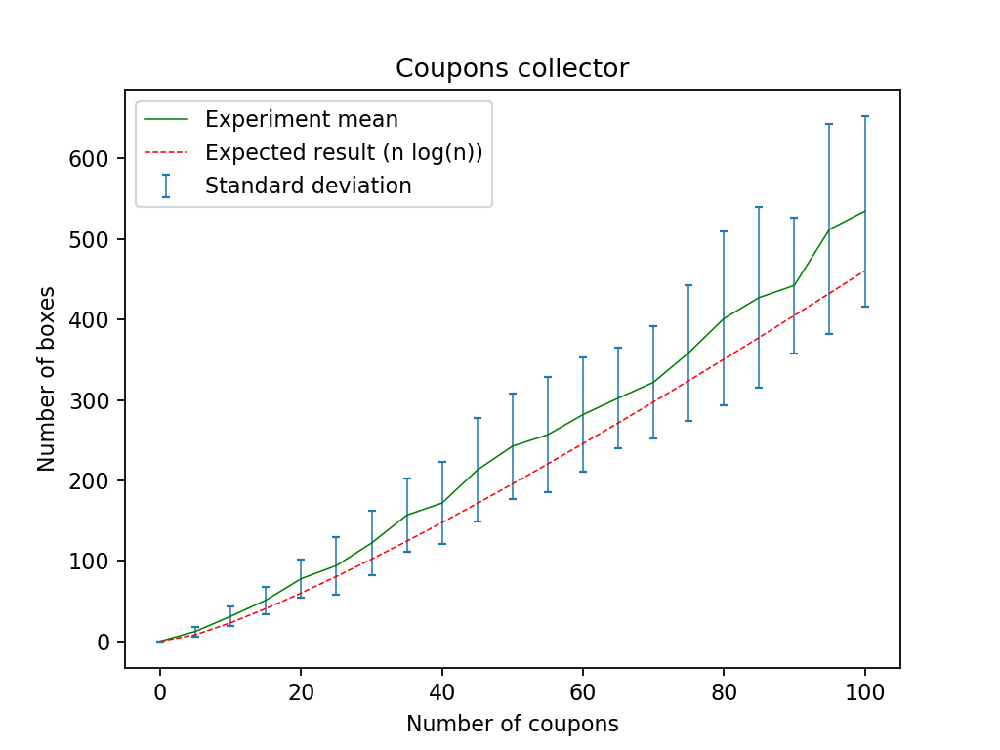
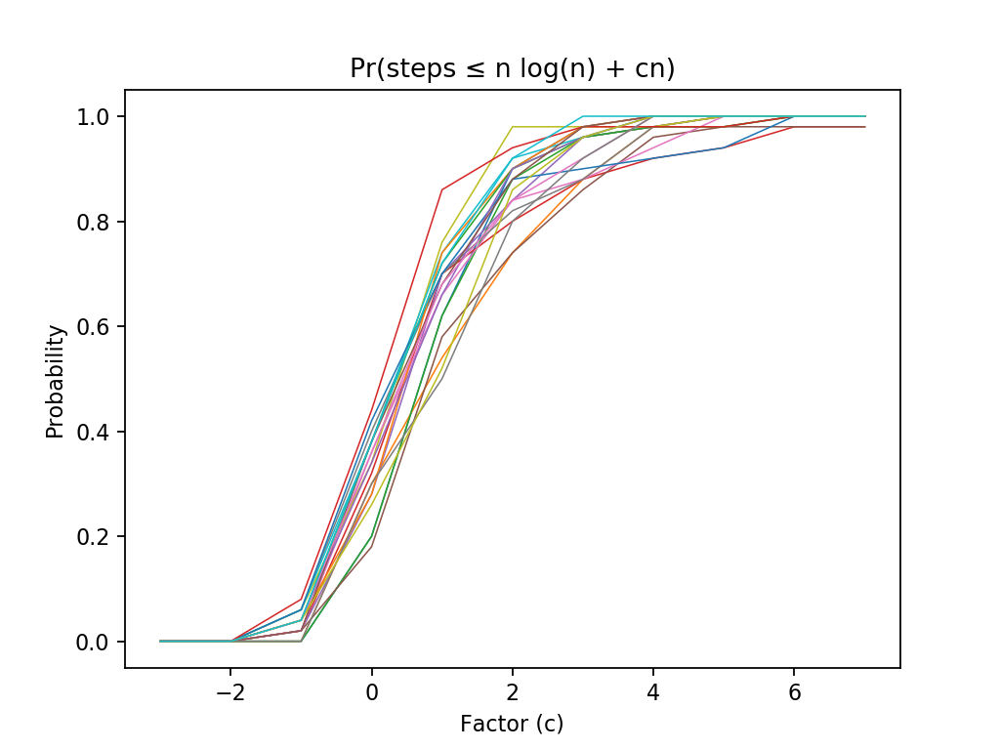

# Coupon collector

## Description

These scripts simulates the coupon collector's problem. The simulation requires two arguments and the third one is optional, all of them are positional.

- **coupons**: Max number of coupons to be tested
- **repetitions**: Number of tests repetitions
- **step**: Step between each coupons test

For example:

if we supply *coupons=100*, *repetitions=50* and *step=10* the script (any of them) will test how many boxes are necessary to collect *0*, *10*, *20*, ... , *90* and *100* coupons, that is, because the step was *10* and number of coupons tested were *100*, this experiment will be repeated 50 times, and, in order to plot the results, the mean and standard deviation will be calculated over 50 repetitions and will be compared with expected value.

## Implementation

The scripts were developed in python and bash (with a python wrapper).

For running the python test you can run next command:

    $ python coupon_collector.py 100 50 5

For running the bash test you can run the command below:

    $ python bash_coupon_collector.py 100 50 5

## Results

For this experiment, the next parameters were supplied:

**coupons**: *100*
**repetitions**: *50*
**step**: *5*

### Python script results

**Running time**: *5.27455* seconds.

### Bash script results

**Running time**: *84.82690* seconds.

