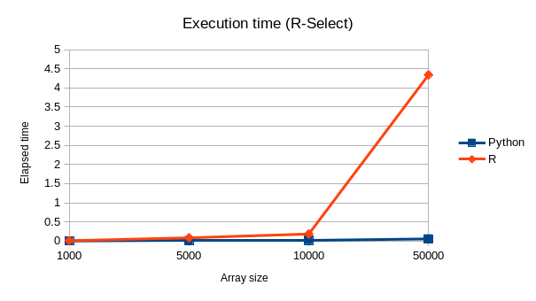
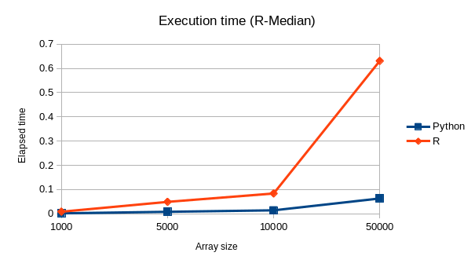

# Median search

## Description

These scripts find an array median using two different randomized algorithms: *Random select* function and *random median*. Used parameters are: 

- **length**: Array length
- **maximum**: Maximum number in the array
- **repetitions**: For random median, this parameter is used for probability amplification.
## Implementation

The scripts were developed in python and R.

For running the python test you can run next command:

    $ python median.py 1000 500 -r 5

Which specifies an array of length 1000. with a maximum number of 500 inside it, and 5 repetitions.

For running the R test you can run the command below:

    $ Rscript median.R -l 1000 -m 500 -r 5

Using the same parameters as those in first example.

## Results

Comparing execution time for each algorithm, and each programming language, we can conclude that Python is much faster than R for large arrays.

